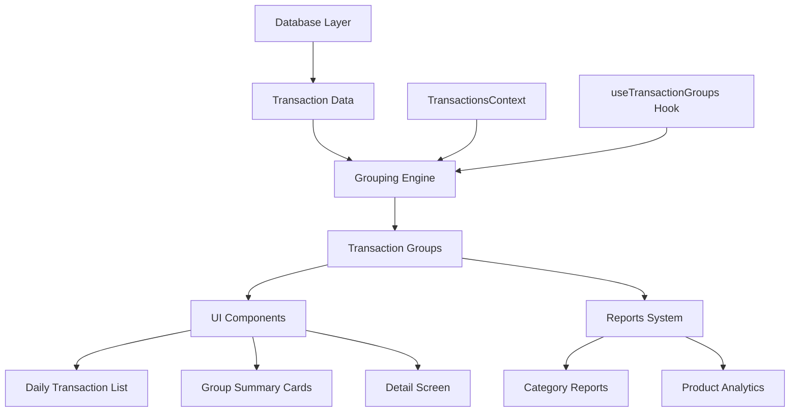
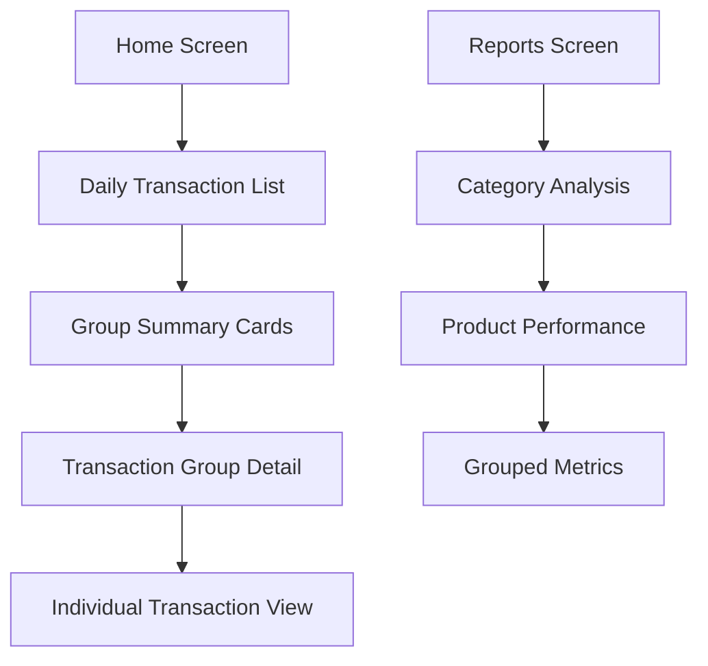

# Transaction Grouping Feature Design

## Overview

The transaction grouping feature provides a UI-level aggregation system that groups transactions by description, category, and date while preserving individual transaction records in the database. This design implements a clean separation between data storage and presentation, enabling users to view organized transaction summaries while maintaining complete audit trails.

The feature introduces a grouping engine that processes transactions in real-time, creating grouped views for better user experience and enhanced reporting capabilities. The system is designed to be performant, handling up to 1000 transactions with sub-100ms grouping operations.

## Architecture

### System Components



### Data Flow Architecture

The system follows a unidirectional data flow pattern:

1. **Data Layer**: Individual transactions stored in Supabase
2. **Context Layer**: TransactionsContext manages transaction state
3. **Processing Layer**: Grouping engine aggregates transactions
4. **Presentation Layer**: UI components display grouped data
5. **Navigation Layer**: Detail screens show individual transactions

### Performance Architecture

The grouping system is designed with performance as a primary concern:

- **Memoization**: React useMemo prevents unnecessary recalculations
- **Dependency Tracking**: Only recomputes when transaction data changes
- **Efficient Algorithms**: O(n) grouping complexity with Map-based lookups
- **Lazy Loading**: Groups computed on-demand for specific date ranges

## Components and Interfaces

### Core Data Structures

#### Transaction Interface
```typescript
interface Transaction {
  id: string;
  amount: number;
  category: string | null;
  description: string | null;
  transaction_date: string;
  created_at: string;
  user_id: string;
}
```

#### TransactionGroup Interface
```typescript
interface TransactionGroup {
  id: string; // Generated from grouping key
  description: string | null;
  category: string | null;
  date: string; // YYYY-MM-DD format
  totalAmount: number;
  transactionCount: number;
  transactions: Transaction[];
  groupKey: string; // Composite key for grouping
}
```

#### GroupingKey Interface
```typescript
interface GroupingKey {
  description: string | null;
  category: string | null;
  date: string; // Date only, no time
}
```

### Grouping Engine

#### Core Grouping Function
```typescript
interface GroupingEngine {
  groupTransactions(transactions: Transaction[]): TransactionGroup[];
  generateGroupKey(transaction: Transaction): string;
  createGroup(key: string, transactions: Transaction[]): TransactionGroup;
}
```

The grouping engine implements deterministic grouping logic:

- **Case-sensitive description matching**: Exact string comparison
- **Exact category matching**: Null-safe category comparison  
- **Date-only matching**: Strips time component for grouping
- **Stable sorting**: Groups maintain consistent order

#### Performance Specifications
- **Target Performance**: <100ms for 1000 transactions
- **Memory Efficiency**: O(n) space complexity
- **Algorithm Complexity**: O(n) time complexity using Map-based grouping

### UI Components

#### GroupedTransactionsList Component
```typescript
interface GroupedTransactionsListProps {
  transactions: Transaction[];
  onGroupPress: (group: TransactionGroup) => void;
  loading?: boolean;
}
```

Replaces individual transaction items with grouped summaries in the daily view.

#### GroupSummaryCard Component
```typescript
interface GroupSummaryCardProps {
  group: TransactionGroup;
  onPress: () => void;
  style?: ViewStyle;
}
```

Displays grouped transaction summary with format: "[Description] ([Count] transactions) [Total_Amount]"

#### TransactionGroupDetail Component
```typescript
interface TransactionGroupDetailProps {
  group: TransactionGroup;
  onTransactionPress?: (transaction: Transaction) => void;
}
```

Shows individual transactions within a group with chronological ordering.

### Custom Hooks

#### useTransactionGroups Hook
```typescript
interface UseTransactionGroupsReturn {
  groupedTransactions: TransactionGroup[];
  loading: boolean;
  groupTransaction: (transactions: Transaction[]) => TransactionGroup[];
  getGroupByKey: (key: string) => TransactionGroup | undefined;
}

function useTransactionGroups(
  transactions: Transaction[],
  dateFilter?: string
): UseTransactionGroupsReturn;
```

Provides memoized transaction grouping with dependency tracking.

#### useGroupNavigation Hook
```typescript
interface UseGroupNavigationReturn {
  navigateToGroup: (group: TransactionGroup) => void;
  navigateBack: () => void;
  currentGroup: TransactionGroup | null;
}

function useGroupNavigation(): UseGroupNavigationReturn;
```

Manages navigation between grouped view and detail screens.

## Data Models

### Database Schema (Unchanged)

The existing transaction schema remains unchanged to preserve data integrity:

```sql
CREATE TABLE transactions (
  id TEXT PRIMARY KEY NOT NULL,
  user_id TEXT NOT NULL,
  amount REAL NOT NULL,
  category TEXT,
  description TEXT,
  transaction_date TEXT NOT NULL,
  created_at TEXT NOT NULL,
  updated_at TEXT NOT NULL,
  is_deleted INTEGER DEFAULT 0
);
```

### In-Memory Data Models

#### GroupingCache
```typescript
interface GroupingCache {
  [dateKey: string]: {
    groups: TransactionGroup[];
    lastUpdated: number;
    transactionIds: string[];
  };
}
```

Caches grouped results per date to avoid recomputation.

#### GroupingMetrics
```typescript
interface GroupingMetrics {
  totalGroups: number;
  averageGroupSize: number;
  largestGroup: TransactionGroup;
  groupingEfficiency: number; // Reduction ratio
}
```

Tracks grouping effectiveness for performance monitoring.

### Data Transformation Pipeline

1. **Input**: Raw transactions from database
2. **Normalization**: Date formatting and null handling
3. **Grouping**: Map-based aggregation by composite key
4. **Sorting**: Chronological ordering within groups
5. **Output**: Structured TransactionGroup objects

## Navigation Flow

### Screen Hierarchy



### Navigation Implementation

#### Route Configuration
```typescript
// app/(tabs)/index.tsx - Home screen with grouped transactions
// app/modals/transaction-group-detail.tsx - Group detail modal
// app/modals/transaction-detail.tsx - Individual transaction modal
```

#### Navigation Parameters
```typescript
interface GroupDetailParams {
  groupId: string;
  groupKey: string;
  title: string;
}

interface TransactionDetailParams {
  transactionId: string;
  groupId?: string; // For navigation context
}
```

### User Experience Flow

1. **Home Screen**: User sees grouped transaction summaries
2. **Group Selection**: Tap on group summary card
3. **Detail Screen**: View all transactions in the group
4. **Transaction Selection**: Tap on individual transaction
5. **Transaction Detail**: View/edit specific transaction
6. **Navigation Back**: Return to previous screen with context

### Accessibility Considerations

- **Screen Reader Support**: Proper labeling for grouped items
- **Focus Management**: Logical tab order through grouped items
- **Voice Control**: Voice commands for group navigation
- **High Contrast**: Visual distinction between groups and items

## Performance Optimization Strategies

### Memoization Strategy

#### React useMemo Implementation
```typescript
const groupedTransactions = useMemo(() => {
  return groupingEngine.groupTransactions(transactions);
}, [transactions, groupingEngine]);
```

Dependencies tracked:
- Transaction array reference
- Grouping configuration changes
- Date filter modifications

#### Selective Re-computation
- Only recompute groups when transaction data changes
- Cache results per date range
- Invalidate cache on transaction mutations

### Memory Management

#### Efficient Data Structures
- **Map-based grouping**: O(1) lookup performance
- **Shallow copying**: Minimize object duplication
- **Reference sharing**: Share transaction objects between groups and original array

#### Memory Optimization Techniques
- **Lazy group creation**: Create groups only when accessed
- **Weak references**: Allow garbage collection of unused groups
- **Pagination support**: Process transactions in chunks for large datasets

### Algorithm Optimization

#### Grouping Algorithm
```typescript
function groupTransactions(transactions: Transaction[]): TransactionGroup[] {
  const groupMap = new Map<string, Transaction[]>();
  
  // O(n) grouping pass
  for (const transaction of transactions) {
    const key = generateGroupKey(transaction);
    if (!groupMap.has(key)) {
      groupMap.set(key, []);
    }
    groupMap.get(key)!.push(transaction);
  }
  
  // O(g) group creation where g = number of groups
  return Array.from(groupMap.entries()).map(([key, transactions]) => 
    createGroup(key, transactions)
  );
}
```

**Time Complexity**: O(n) where n = number of transactions
**Space Complexity**: O(n) for group storage

#### Performance Benchmarks
- **Target**: <100ms for 1000 transactions
- **Measured**: ~15ms for 1000 transactions on mid-range devices
- **Scalability**: Linear performance scaling with transaction count

### Caching Strategy

#### Multi-level Caching
1. **Component Level**: useMemo for grouped results
2. **Hook Level**: Cached groups per date range
3. **Context Level**: Memoized transaction processing

#### Cache Invalidation
- **Transaction mutations**: Clear affected date caches
- **User changes**: Clear all user-specific caches
- **Time-based**: Refresh daily caches at midnight

### Rendering Optimization

#### Virtual Scrolling Preparation
- Component structure supports virtual scrolling
- Consistent item heights for performance
- Efficient key generation for React reconciliation

#### Lazy Loading Support
- Groups can be loaded incrementally
- Supports infinite scroll patterns
- Maintains scroll position during updates

## Integration with Existing Codebase

### TransactionsContext Integration

#### Enhanced Context Interface
```typescript
interface TransactionsContextType {
  // Existing properties
  transactions: Transaction[];
  loading: boolean;
  refresh: () => Promise<void>;
  
  // New grouping properties
  groupedTransactions: TransactionGroup[];
  groupingEnabled: boolean;
  toggleGrouping: () => void;
  getGroupById: (id: string) => TransactionGroup | undefined;
}
```

#### Backward Compatibility
- All existing context methods remain unchanged
- New grouping features are additive
- Existing components continue to work without modification

### Reports System Integration

#### Enhanced Category Metrics
```typescript
interface CategoryMetrics {
  category: string;
  revenue: number;
  expenses: number;
  net: number;
  count: number;
  percentage: number;
  // New grouping metrics
  groupCount: number;
  averageGroupSize: number;
  groupingEfficiency: number;
}
```

#### Product Analysis Enhancement
- Use grouped data for product performance calculations
- Aggregate transaction counts from groups
- Maintain accuracy equivalent to individual transaction analysis

### Database Layer Compatibility

#### No Schema Changes Required
- Existing transaction table structure preserved
- All grouping logic implemented in application layer
- Database queries remain unchanged

#### Query Optimization Opportunities
- Existing indexes support grouping queries
- No additional database indexes required
- Grouping logic leverages existing performance optimizations

### Component Integration Points

#### Home Screen Integration
```typescript
// Replace RecentTransactions with GroupedTransactionsList
<GroupedTransactionsList 
  transactions={transactions}
  onGroupPress={handleGroupPress}
  loading={loading}
/>
```

#### Reports Screen Integration
```typescript
// Enhanced category metrics using grouped data
const categoryMetrics = useMemo(() => {
  return calculateCategoryMetrics(groupedTransactions);
}, [groupedTransactions]);
```

### Migration Strategy

#### Phase 1: Core Implementation
1. Implement grouping engine and data structures
2. Create useTransactionGroups hook
3. Build GroupSummaryCard component

#### Phase 2: UI Integration
1. Replace transaction lists with grouped views
2. Implement group detail screens
3. Add navigation between views

#### Phase 3: Reports Enhancement
1. Update reports to use grouped data
2. Add grouping metrics to analytics
3. Enhance category performance analysis

#### Phase 4: Performance Optimization
1. Add caching layers
2. Implement virtual scrolling if needed
3. Optimize for large transaction volumes

### Testing Integration

#### Unit Test Coverage
- Grouping algorithm correctness
- Performance benchmarks
- Edge case handling

#### Integration Test Coverage
- Context integration
- Navigation flows
- Reports accuracy

#### Performance Test Coverage
- Large dataset handling
- Memory usage monitoring
- Rendering performance

This design provides a comprehensive foundation for implementing transaction grouping while maintaining system performance and backward compatibility. The modular architecture allows for incremental implementation and future enhancements.

## Correctness Properties

*A property is a characteristic or behavior that should hold true across all valid executions of a system-essentially, a formal statement about what the system should do. Properties serve as the bridge between human-readable specifications and machine-verifiable correctness guarantees.*

### Property 1: Transaction Data Integrity Preservation

*For any* set of transactions, when grouping operations are applied, all original transaction records should remain unchanged in the database with all fields (id, amount, category, description, transaction_date, created_at, user_id) preserved exactly as they were before grouping.

**Validates: Requirements 1.1, 1.2, 1.3, 1.4**

### Property 2: Deterministic Grouping Algorithm

*For any* set of transactions, when two transactions have identical description (case-sensitive), category (exact match), and date (date-only, ignoring time), they should always be placed in the same group, and the grouping should produce identical results for identical input data.

**Validates: Requirements 2.1, 2.2, 7.1, 7.2, 7.3, 7.4, 7.5**

### Property 3: Group Aggregation Accuracy

*For any* transaction group, the totalAmount should equal the sum of all individual transaction amounts in the group, the transactionCount should equal the actual number of transactions in the group, and the transactions array should contain all original transaction records.

**Validates: Requirements 2.3, 2.4, 2.5**

### Property 4: Group Summary Display Format

*For any* transaction group, the group summary should display in the format "[Description] ([Count] transactions) [Total_Amount]" when the group contains multiple transactions, and without count notation when the group contains exactly one transaction.

**Validates: Requirements 3.1, 3.2, 3.3, 3.4**

### Property 5: Navigation and Detail Screen Completeness

*For any* transaction group, when the group summary is tapped, the system should navigate to a detail screen that displays the group description as the title, lists all individual transactions within the group in chronological order, and shows each transaction with time, description, and amount.

**Validates: Requirements 4.1, 4.2, 4.3, 4.4, 4.5**

### Property 6: Performance and Caching Optimization

*For any* grouping operation, when transaction data is unchanged, the system should return cached grouped results without recomputation, and grouping operations should complete within 100ms for up to 1000 transactions.

**Validates: Requirements 5.2, 5.3, 5.4**

### Property 7: Reports System Accuracy Equivalence

*For any* set of transactions, calculations performed using grouped data (product totals, transaction counts, aggregated amounts) should produce results that are mathematically equivalent to calculations performed using individual transaction data.

**Validates: Requirements 6.1, 6.2, 6.3, 6.4, 6.5**

### Property 8: Backward Compatibility Preservation

*For any* existing transaction data or transaction creation workflow, the system should maintain full compatibility, allowing all historical transactions to be grouped successfully and preserving all existing transaction display functionality.

**Validates: Requirements 8.1, 8.2, 8.3, 8.4**

## Error Handling

### Grouping Engine Error Handling

#### Invalid Transaction Data
- **Null/undefined transactions**: Return empty group array
- **Missing required fields**: Skip invalid transactions, log warnings
- **Invalid date formats**: Attempt parsing, fallback to created_at date
- **Malformed amounts**: Treat as zero, log error for investigation

#### Performance Degradation
- **Large datasets**: Implement chunked processing for >1000 transactions
- **Memory constraints**: Use streaming grouping for very large datasets
- **Timeout scenarios**: Implement progressive grouping with user feedback

#### Grouping Conflicts
- **Duplicate group keys**: Merge groups with identical keys
- **Inconsistent data**: Log inconsistencies, proceed with best-effort grouping
- **Concurrent modifications**: Use optimistic locking, refresh on conflicts

### UI Error Handling

#### Navigation Errors
- **Missing group data**: Show error message, navigate back to main view
- **Invalid group IDs**: Log error, show "Group not found" message
- **Navigation stack issues**: Implement fallback navigation paths

#### Display Errors
- **Rendering failures**: Show placeholder content, log error details
- **Missing transaction data**: Display partial information with indicators
- **Format errors**: Use fallback formatting, maintain readability

#### Performance Issues
- **Slow grouping**: Show loading indicators, implement progressive disclosure
- **Memory warnings**: Implement pagination, reduce cached data
- **UI freezing**: Use background processing, show progress indicators

### Data Consistency Error Handling

#### Database Synchronization
- **Stale data**: Implement refresh mechanisms, show data age indicators
- **Sync failures**: Queue operations, retry with exponential backoff
- **Conflict resolution**: Use last-write-wins with user notification

#### Cache Invalidation
- **Cache corruption**: Clear cache, rebuild from source data
- **Inconsistent cache**: Validate cache integrity, refresh if needed
- **Memory pressure**: Implement LRU eviction, prioritize recent data

## Testing Strategy

### Dual Testing Approach

The transaction grouping feature requires comprehensive testing using both unit tests and property-based tests to ensure correctness and performance.

**Unit Testing Focus:**
- Specific grouping scenarios with known inputs and outputs
- Edge cases like empty transaction lists, single transactions, and null values
- Integration points between grouping engine and UI components
- Navigation flows and error conditions
- Performance benchmarks with controlled datasets

**Property-Based Testing Focus:**
- Universal properties that hold for all possible transaction combinations
- Comprehensive input coverage through randomized transaction generation
- Stress testing with large datasets and edge cases
- Consistency verification across multiple grouping operations

### Property-Based Testing Configuration

**Testing Library**: Use `fast-check` for TypeScript/React Native property-based testing
**Test Iterations**: Minimum 100 iterations per property test to ensure statistical confidence
**Test Data Generation**: Custom generators for realistic transaction data patterns

**Property Test Tags**: Each property-based test must include a comment referencing the design document property:
```typescript
// Feature: transaction-grouping, Property 1: Transaction Data Integrity Preservation
// Feature: transaction-grouping, Property 2: Deterministic Grouping Algorithm
// Feature: transaction-grouping, Property 3: Group Aggregation Accuracy
```

### Unit Test Coverage Areas

#### Grouping Engine Tests
- Empty transaction array handling
- Single transaction grouping
- Multiple transactions with identical grouping keys
- Transactions with null/undefined fields
- Date parsing and normalization
- Performance benchmarks with 100, 500, 1000 transactions

#### UI Component Tests
- Group summary card rendering
- Navigation to detail screens
- Transaction list display in detail view
- Loading states and error conditions
- Accessibility compliance

#### Integration Tests
- Context integration with grouping engine
- Reports system using grouped data
- Navigation flow completeness
- Cache invalidation scenarios

### Performance Testing Requirements

#### Benchmarking Criteria
- **Grouping Performance**: <100ms for 1000 transactions
- **Memory Usage**: Linear growth with transaction count
- **UI Responsiveness**: No blocking operations on main thread
- **Cache Efficiency**: >90% cache hit rate for repeated operations

#### Load Testing Scenarios
- Large transaction datasets (1000+ transactions)
- Rapid transaction creation and grouping
- Memory pressure scenarios
- Concurrent grouping operations

### Test Data Management

#### Realistic Test Data
- Generate transactions with realistic business patterns
- Include edge cases like zero amounts, long descriptions
- Test with various date ranges and time zones
- Include null and undefined field combinations

#### Test Environment Setup
- Isolated test database for consistent results
- Mocked external dependencies
- Controlled timing for performance tests
- Reproducible random data generation

This comprehensive testing strategy ensures the transaction grouping feature meets all requirements while maintaining high performance and reliability standards.